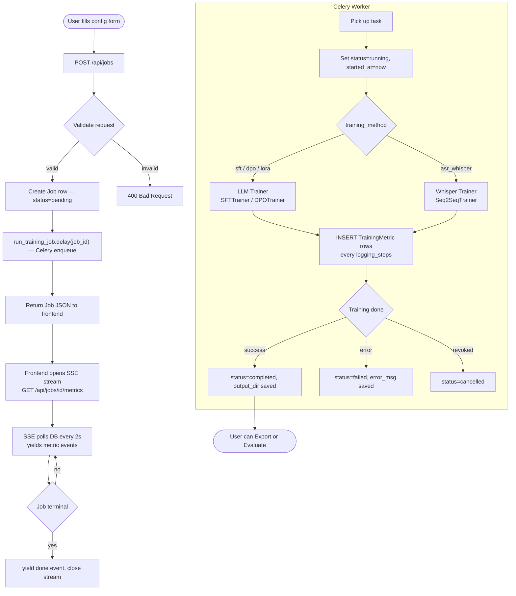
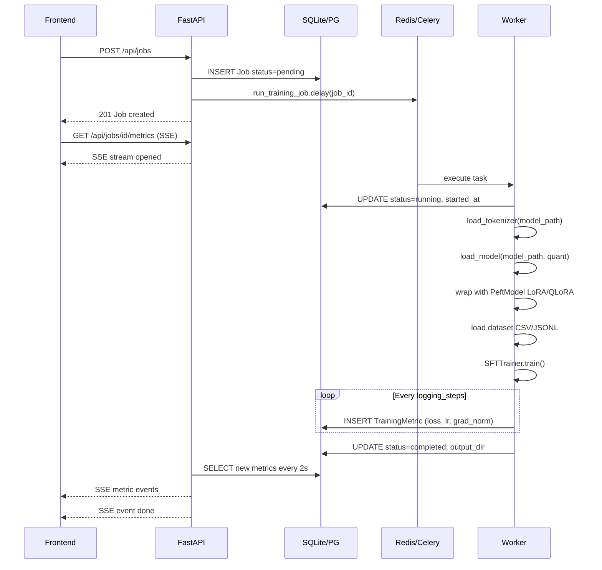
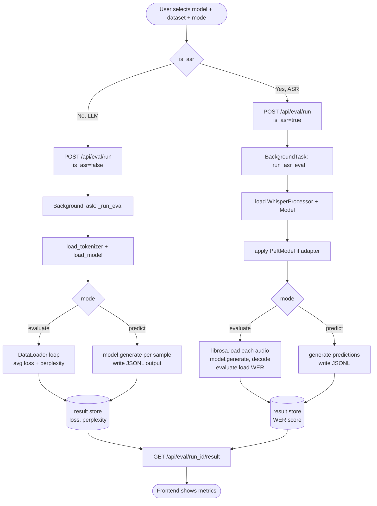
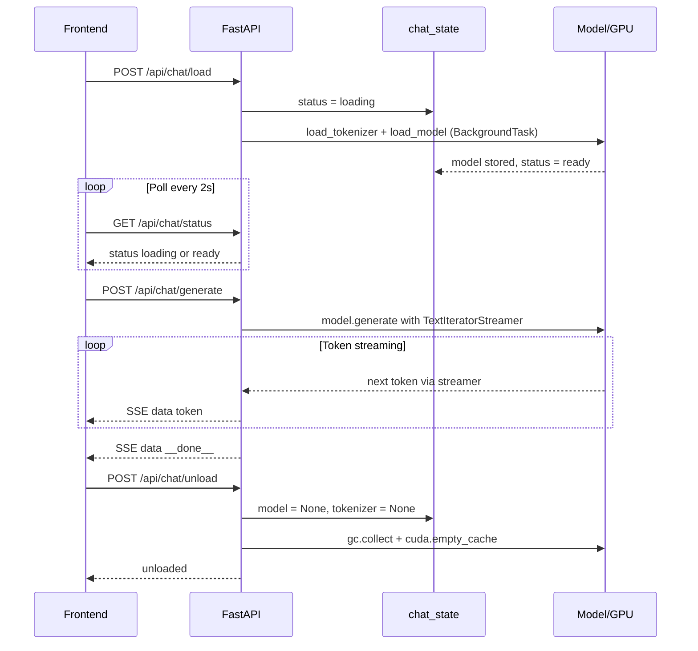
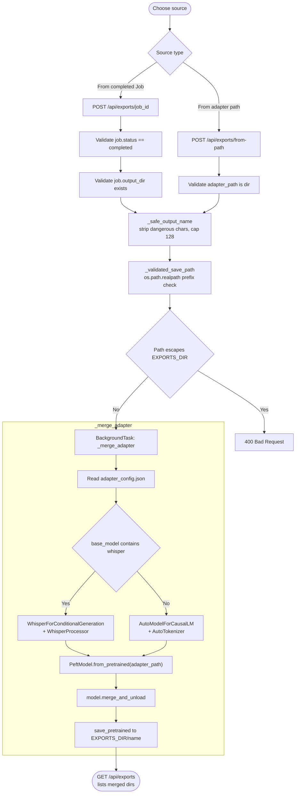

# Forge — System Flow Documentation

## 1. Architecture Overview

```
┌─────────────────────────────────────────────────────────────┐
│                        Browser (Next.js)                    │
│  ┌──────────┬──────────┬──────────┬──────────┬──────────┐  │
│  │  LLM /   │   ASR /  │ Evaluate │   Chat   │  Export  │  │
│  │ Training │ Training │  /eval   │  /chat   │ /export  │  │
│  └────┬─────┴────┬─────┴────┬─────┴────┬─────┴────┬─────┘  │
│       │ REST/SSE │          │          │          │         │
└───────┼──────────┼──────────┼──────────┼──────────┼─────────┘
        │          │          │          │          │
        ▼          ▼          ▼          ▼          ▼
┌───────────────────────────────────────────────────────────┐
│              FastAPI Backend  (uvicorn)                   │
│  /api/jobs  /api/asr  /api/eval  /api/chat  /api/exports  │
│  /api/models  /api/datasets  /api/system                  │
└──────────┬───────────────────────────┬────────────────────┘
           │                           │
     ┌─────▼─────┐              ┌──────▼──────┐
     │  SQLite / │              │  Celery     │
     │  Postgres │              │  Worker     │
     │  (ORM)    │              │  (Redis)    │
     └─────┬─────┘              └──────┬──────┘
           │                           │
           └──────────┬────────────────┘
                      │
               ┌──────▼──────┐
               │  HuggingFace│
               │  Trainer    │
               │  (GPU)      │
               └─────────────┘
```

### Component Responsibilities

| Component | Role |
|-----------|------|
| **Next.js frontend** | SPA with React Query for data fetching; SSE for real-time metrics/tokens |
| **FastAPI** | REST API + SSE endpoints; request validation; background task dispatch |
| **SQLite/Postgres** | Persistent store for jobs, models, datasets, metrics |
| **Celery + Redis** | Async task queue for long-running training jobs |
| **HuggingFace Trainer** | Actual model training (runs inside the Celery worker process) |

---

## 2. Training Job Lifecycle



---

## 3. LLM Training Flow (detailed)



---

## 4. ASR Training Flow

```mermaid
flowchart LR
    A(["Upload ZIP or CSV"]) --> B{"Upload type"}

    subgraph ZipUpload["ZIP Upload"]
        B -- ZIP --> C["Extract to datasets/audio/name/"]
        C --> D["Zip-slip guard:\nrealpath prefix check"]
        D --> E[Find CSV in extracted dir]
        E --> F["Rewrite audio paths\nby filename match"]
        F --> G["Save canonical CSV\nto datasets/"]
    end

    subgraph CsvUpload["CSV Upload"]
        B -- CSV --> H["Save CSV to datasets/"]
    end

    G --> I[("Dataset DB row\nformat=asr_csv")]
    H --> I

    I --> J(["Create ASR Job\nPOST /api/asr/jobs"])
    J --> K["Celery: run_training_job"]

    subgraph ASRWorker["ASR Worker"]
        K --> L[load WhisperProcessor]
        L --> M[load WhisperForConditionalGeneration]
        M --> N[wrap PeftModel LoRA]
        N --> O[Read CSV rows]
        O --> P["librosa.load each audio"]
        P --> Q[Seq2SeqTrainer.train]
        Q --> R[TrainingMetric rows]
    end

    R --> S(["Completed adapter\nin output_dir/"])
```



---

## 5. Dataset Upload Flow

```mermaid
flowchart TD
    subgraph TextDataset["Text Dataset — JSON / JSONL"]
        A([Select file]) --> B[Client reads first 3 records]
        B --> C{"Auto-detect format"}
        C -- "conversations / messages" --> D[sharegpt]
        C -- "prompt + chosen + rejected" --> E[dpo]
        C -- "prompt + completion + label" --> F[kto]
        C -- "instruction / output" --> G[alpaca]
        C -- other --> H[plain_text]
        D --> I["POST /api/datasets\nmultipart form"]
        E --> I
        F --> I
        G --> I
        H --> I
        I --> J[("Dataset row\nformat detected")]
    end

    subgraph ASRZip["ASR Dataset — ZIP"]
        K([Select ZIP]) --> L["POST /api/asr/datasets/zip"]
        L --> M[Read all bytes into memory]
        M --> N["Validate each member path\nzip-slip guard"]
        N --> O["Validate CSV exists\nbefore extracting"]
        O --> P["extractall to datasets/audio/name/"]
        P --> Q[Build audio filename lookup]
        Q --> R["Rewrite CSV audio_col\nwith absolute paths"]
        R --> S[("Dataset row\nformat=asr_csv")]
    end

    subgraph ASRCsv["ASR Dataset — CSV"]
        T(["Select CSV\nwith server paths"]) --> U["POST /api/asr/datasets"]
        U --> V[("Dataset row\nformat=asr_csv")]
    end
```



---

## 6. Evaluate & Predict Flow



---

## 7. Chat Flow



---

## 8. Export (Merge) Flow



---

## 9. Security Controls Summary

| Attack Vector | Location | Mitigation |
|---------------|----------|------------|
| **Path traversal** in `output_name` | `exports.py` | `_safe_output_name()` strips dangerous chars; `_validated_save_path()` uses `realpath()` prefix check |
| **Zip-slip** in ZIP upload | `asr.py` | Every member path checked with `realpath` before `extractall` |
| **SSE DB session leak** | `jobs.py`, `asr.py` | Generator opens its own `SessionLocal()` with `finally: db.close()` |
| **Stale localStorage value** | `ThemeProvider.tsx` | Explicit equality check: `stored === "light" \|\| stored === "dark"` |
| **Chat fetch not cleaned up** on unmount | `chat/page.tsx` | `useEffect` cleanup aborts in-flight request via `AbortController` |
| **Silent chat errors** | `chat/page.tsx` | Non-2xx response body shown as `[Error: …]` assistant message |

---

## 10. Database Schema

```
jobs
├── id              INTEGER PK
├── name            TEXT
├── status          TEXT  (pending / running / completed / failed / cancelled)
├── training_method TEXT  (sft / dpo / kto / asr_whisper / …)
├── peft_method     TEXT  (lora / qlora / dora / full)
├── model_id        FK → models.id
├── dataset_id      FK → datasets.id
├── config_json     JSON
├── output_dir      TEXT
├── error_msg       TEXT
├── celery_task_id  TEXT
├── remarks         TEXT  (nullable — user notes)
├── created_at      DATETIME
├── started_at      DATETIME
└── finished_at     DATETIME

training_metrics
├── id              INTEGER PK
├── job_id          FK → jobs.id (CASCADE DELETE)
├── step            INTEGER
├── epoch           FLOAT
├── loss            FLOAT
├── eval_loss       FLOAT
├── learning_rate   FLOAT
├── reward          FLOAT
├── grad_norm       FLOAT
└── timestamp       DATETIME

models
├── id              INTEGER PK
├── name            TEXT
├── hf_repo         TEXT
├── architecture    TEXT
├── template        TEXT
├── is_downloaded   BOOL
├── local_path      TEXT
├── downloaded_at   DATETIME
└── created_at      DATETIME

datasets
├── id              INTEGER PK
├── name            TEXT
├── path            TEXT
├── format          TEXT  (alpaca / sharegpt / dpo / kto / plain_text / asr_csv)
├── num_samples     INTEGER
├── description     TEXT
└── created_at      DATETIME
```

---

## 11. API Reference

| Method | Path | Description |
|--------|------|-------------|
| GET | `/api/jobs` | List all LLM jobs |
| POST | `/api/jobs` | Create LLM training job |
| DELETE | `/api/jobs/{id}` | Cancel job (Celery revoke) |
| DELETE | `/api/jobs/{id}/purge` | Hard-delete job + metrics |
| PATCH | `/api/jobs/{id}/remarks` | Update job notes |
| GET | `/api/jobs/{id}/metrics` | SSE stream of training metrics |
| GET | `/api/jobs/{id}/metrics/all` | All metrics as JSON |
| GET | `/api/asr/jobs` | List ASR jobs |
| POST | `/api/asr/jobs` | Create ASR training job |
| GET | `/api/asr/datasets` | List ASR datasets |
| POST | `/api/asr/datasets` | Upload CSV dataset |
| POST | `/api/asr/datasets/zip` | Upload ZIP (audio + CSV) |
| GET | `/api/asr/datasets/{id}/preview` | First 5 CSV rows |
| GET | `/api/datasets` | List text datasets |
| POST | `/api/datasets` | Upload JSON/JSONL dataset |
| GET | `/api/datasets/{id}/preview` | First 5 records |
| GET | `/api/models` | List registered models |
| POST | `/api/models` | Register HuggingFace model |
| POST | `/api/models/{id}/download` | Start model download |
| POST | `/api/eval/run` | Start eval/predict run |
| GET | `/api/eval/{run_id}/result` | Poll eval result |
| POST | `/api/chat/load` | Load model for chat |
| GET | `/api/chat/status` | Chat model status |
| POST | `/api/chat/generate` | Generate (SSE token stream) |
| POST | `/api/chat/unload` | Unload chat model |
| GET | `/api/exports` | List merged exports |
| POST | `/api/exports/{job_id}` | Export (merge) from job |
| POST | `/api/exports/from-path` | Export from arbitrary adapter path |
| GET | `/api/system` | GPU/CPU/RAM stats |
